# Proiect Ciuca_Ionel-Andrei 313CB ( TASK 1)

### Ca sa putem sa rulam comenzile din aceste cerinte trebuie sa avem instalat 
- #### python 3.x ( pentru a instala) 
``$ sudo apt-get update`` 
``$ sudo apt-get install python3.x`` 
- #### Pandas ( pentru a instala) 
``$ sudo pip install pandas``
- #### Matplotlib ( pentru a instala) 
``$ sudo pip install matplotlib``
- #### Seaborn ( pentru a instala) 
``$ sudo pip install seaborn``

## Cerinta 1
- Citim din fisierul CSV
- Afisam primele randuri
- Afisam numarul de coloane
- Afisam tipurile de date
- Afisam numarul valorila lipsa
- Afisam numarul de randuri
- Afisam randurile duplicate

- Rezultate obtinute:

#### Primele randuri din fisierul train:
   PassengerId  Survived  Pclass  ...     Fare Cabin  Embarked
0            1         0       3  ...   7.2500   NaN         S
1            2         1       1  ...  71.2833   C85         C
2            3         1       3  ...   7.9250   NaN         S
3            4         1       1  ...  53.1000  C123         S
4            5         0       3  ...   8.0500   NaN         S

[5 rows x 12 columns]

#### Numarul de coloane din train 12

#### Ce tipuri de date se afla pe prima coloana: PassengerId      int64
- Survived         int64
- Pclass           int64
- Name            object
- Sex             object
- Age            float64
- SibSp            int64
- Parch            int64
- Ticket          object
- Fare           float64
- Cabin           object
- Embarked        object
- dtype: object

#### Numarul de valori lipsa pentru fiecare coloana:
- PassengerId      0
- Survived         0
- Pclass           0
- Name             0
- Sex              0
- Age            177
- SibSp            0
- Parch            0
- Ticket           0
- Fare             0
- Cabin          687
- Embarked         2
- dtype: int64

#### Numarul de linii: 891

#### Nu exista linii duplicate in train

## Cerinta 2
- Citim din fisierul CSV
- Calculam procentul de supravietuitori si nesupravietuitori
- Calcualm procentul de pasageri din prima clasa
- Calculam procentul tipului de gen
- Cream graficul pentru supravietuitor si nesupravietuitor
- Cream graficul pentru clase
- Creeam graficul pentru gen
- Afisam graficele

- Rezultate obtinute

### Procent supravietuitori
- Se observa ca supravietuitorii au un procent mai mic fata de cei care nu au trait

### Procent clase
- Procentul este descrescator, de la clasa 3, la 2, la 1

### Procent sex
- Au fost mai multi barbati decat femei

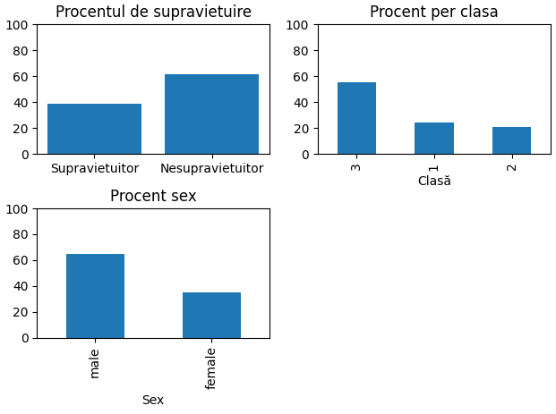

## Cerinta 3
- Citim din fisierul CSV
- Selectam coloanele numerice
- Creeam Histograma pentru fiecare coloana numerica
- bins reprezinta numarul de intervale

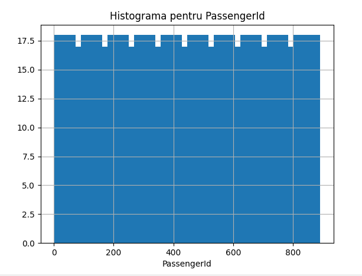
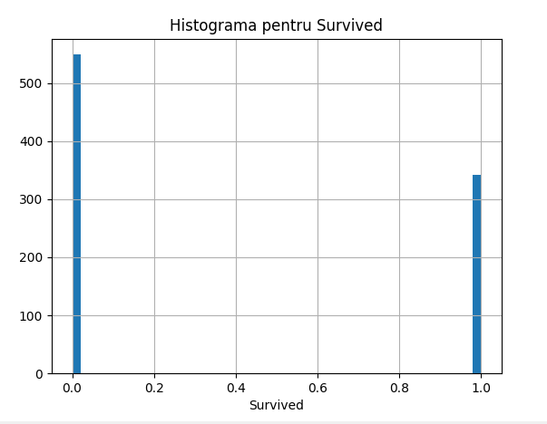
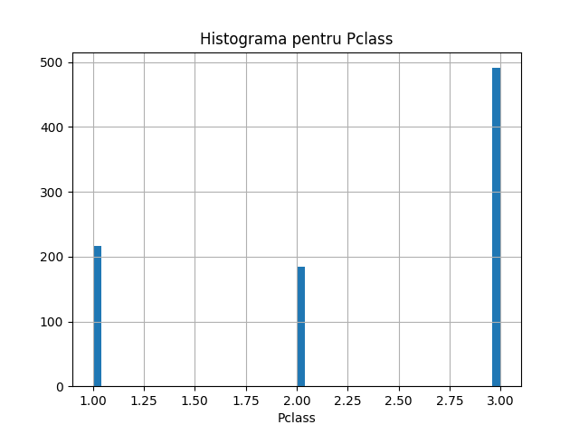
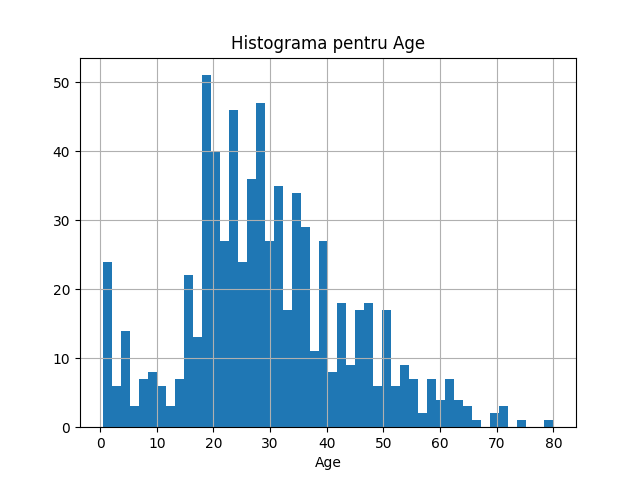
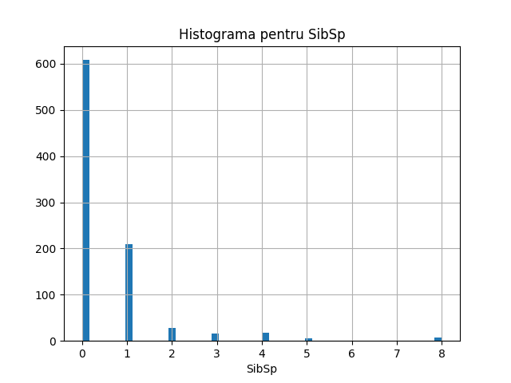
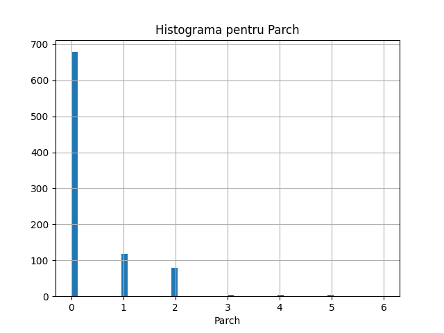
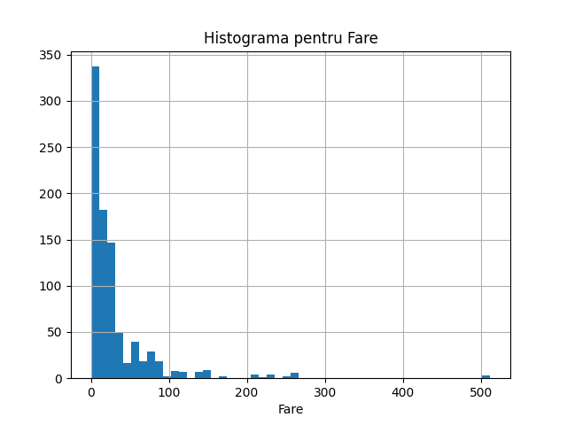

## Cerinta 4
- Citim din fisierul CSV
- Identificam coloanele cu valori lipsa
- Printam coloanele cu valori lipsa
- Printam numarul valorilor lipsa
- Calculam procentul de valori lipsa pentru pasagerii supravietuitori si nesupravietuitori
- Printam procentul de valori lipsa pentru pasagerii supravietuitori
- Acum printam valorile lipsa pentru pasagerii nesupravietuitori

- Rezultate obtinute:

#### Coloanele cu valori lipsa:
- Age         177
- Cabin       687
- Embarked      2
- dtype: int64

#### Numarul si proportia valorilor lipsa:
- Age         19.865320
- Cabin       77.104377
- Embarked     0.224467
- dtype: float64

#### Procent valori lipsa surv == 1
- Age         15.204678
- Cabin       60.233918
- Embarked     0.584795
- dtype: float64

#### Procent valori lipsa surv == 0
- Age      22.768670
- Cabin    87.613843
- dtype: float64

## Cerinta 5
- Citim din fisierul CSV
- Dfinim tipurile de varsta
- Daugam coloana suplimentara pentru tipul de varsta
- Calculam numarul de pasageri per categorie
- Creeam graficul cu bare

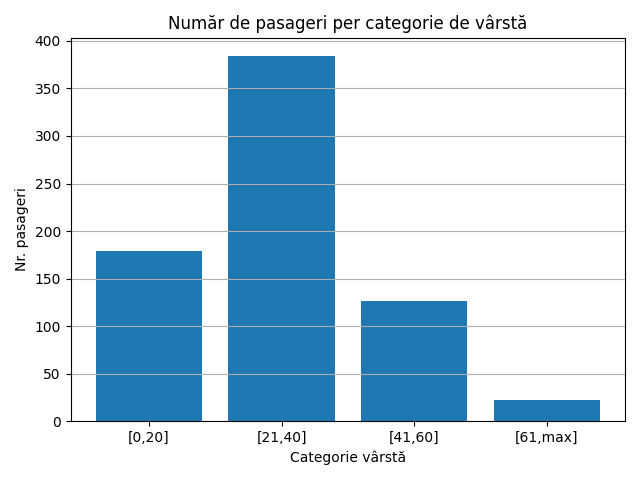

## Cerinta 6
- Citim din fisierul CSV
- Definim categoria de varsta
- Caclulam numarul de barbati supravietuitori per fiecare categorie de varsta
- Calculam numarul total de barbati per categorie de varsta
- Calculam procentul de supravietuire
- Facem graficul

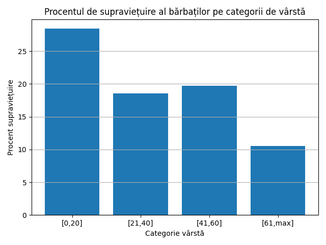

## Cerinta 7
- Citim din fisierul CSV
- Definim grupurile de varsta pentru copii si adulti
- Calculam numarul total de participanti pentru copii si adulti
- Calculam procentu de copii
- Calculam rata de supravietuire pentru copii si adulti
- Creeam graficul pentru rata de supravietuire

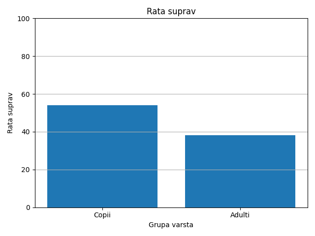

## Cerinta 8
- Citim din fisierul CSV
- Calculam media pentru varsta si tarif si modulul pentru cabina si portul de imbarcare
- Definim functiile pentru completarea valorilor lipsa
- Urmeaza sa completam valorile lipsa pentru coloanele numerice si pentru coloanele categorice
- Verificam daca ami exista valori nule si afisam

- Rezultate obtinute:
#### Am modificat coloanele care aveau valori lipsa

## Cerinta 9
- Citim din fisierul CSV
- Extragem titlurile din "Name"
- Definim un dictionar pentru Maparea acestora
- Verificam daca titlurile sunt corecte
- Numaram persoanele pentru fiecare titlu in parte
- Verificam titlurile corecte si afisam
- Aflam persoanele cu titluri incorecte si afisam
- Creeam graficul cu numarul de persoane pentru fiecare titlu in parte

## Cerinta 10
- Citim din fisierul CSV
- Verificam pasagerii daca sunt singuri sau nu
- Creeam histograma pentru starea de a fi singur si sansele de a supravietuii
- Selectam primele 100 de inregistrari
- Creeam diagrama pentru relatiile de tip tarif, clasa si supravietuire

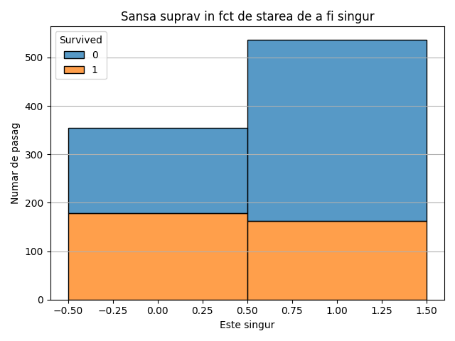
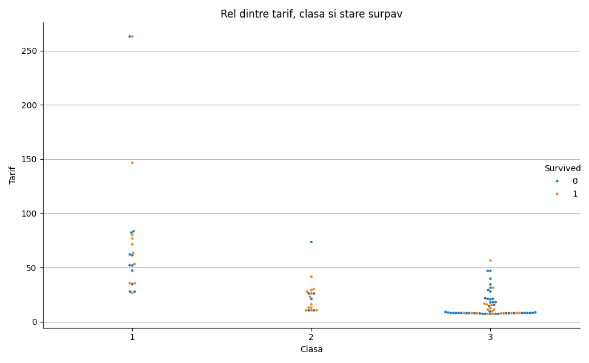
